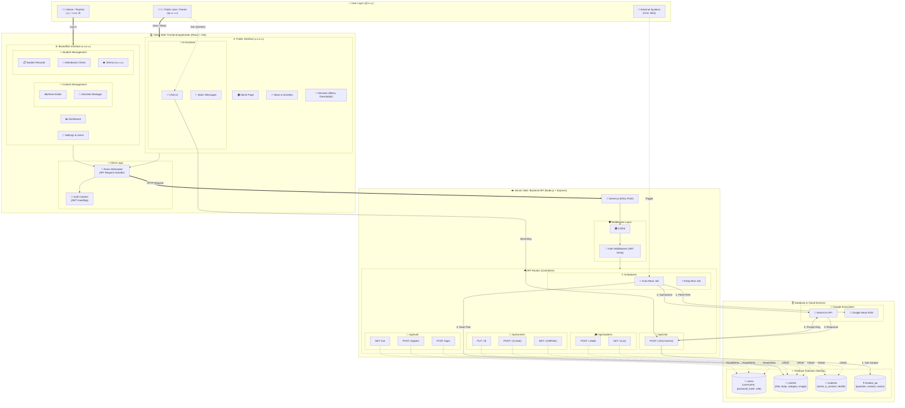

# 🏫 Nongmim Child Development Center Management System

## 📋 ภาพรวมโปรเจกต์ (Project Overview)
ระบบบริหารจัดการศูนย์พัฒนาเด็กเล็กแบบ Full-stack ที่เชื่อมต่อระหว่างเว็บไซต์ประชาสัมพันธ์และระบบหลังบ้านสำหรับผู้ดูแลระบบ (Admin) โดยมีการนำ **AI (Google Gemini)** มาช่วยในการทำงานอัตโนมัติ เช่น การเขียนข่าวและการตอบคำถาม

## 🛠️ เทคโนโลยีที่ใช้ (Tech Stack)
*   **Frontend**: React.js (Vite), Tailwind CSS
    *   *Hosting*: **Firebase Hosting**
*   **Backend**: Node.js, Express.js
    *   *Hosting*: **Render (Cloud Application Hosting)**
*   **Database**: **Firebase Cloud Firestore** (NoSQL Database)
*   **AI Integration**: Google Gemini API (สำหรับสรุปข่าวและ Chatbot)
*   **Automation**: Node-cron + External Cron Trigger

## 🏗️ แผนภาพการทำงานของระบบ (System Architecture)


```mermaid
graph TD
    %% ==========================================
    %% 1. USER LAYERS (ผู้ใช้งาน)
    %% ==========================================
    subgraph Users ["👥 User Layer (ผู้ใช้งาน)"]
        Parent["👨‍👩‍👧 Public User / Parent<br>(ผู้ปกครอง)"]
        AdminUser["👩‍🏫 Admin / Teacher<br>(ครู / เจ้าหน้าที่)"]
        ExternalSys["🤖 External Systems<br>(Cron Jobs)"]
    end

    %% ==========================================
    %% 2. FRONTEND LAYER (ส่วนแสดงผล)
    %% ==========================================
    subgraph Frontend ["💻 Client Side: Frontend Application (React + Vite)"]
        direction TB
        
        %% 2.1 Public Modules
        subgraph PublicApp ["🌐 Public Interface (หน้าบ้าน)"]
            HomePg["🏠 Home Page"]
            NewsPg["📰 News & Activities"]
            ServicePg["🍱 Services (Menu, Downloads)"]
            
            subgraph AIChatWidget ["🤖 AI Assistant"]
                ChatUI["💬 Chat UI"]
                ChatState["⚡ State: Messages"]
            end
        end

        %% 2.2 Admin Modules
        subgraph AdminApp ["⚙️ Backoffice Interface (หลังบ้าน)"]
            Dashboard["📊 Dashboard"]
            
            subgraph CMS_Module ["📝 Content Management"]
                NewsEditor["✍️ News Editor"]
                ActivityMgr["🏃 Activities Manager"]
            end
            
            subgraph Edu_Module ["👶 Student Management"]
                StudentList["📋 Student Records"]
                Attendance["📅 Attendance Check"]
                JitArsa["❤️ JitArsa (จิตอาสา)"]
            end
            
            SettingsUI["🔧 Settings & Users"]
        end

        %% 2.3 Shared Logic
        subgraph ClientLogic ["🧠 Client Logic"]
            Axios["📡 Axios Interceptor<br>(API Request Handler)"]
            AuthCtx["🔐 Auth Context<br>(JWT Handling)"]
        end
    end

    %% ==========================================
    %% 3. BACKEND LAYER (ส่วนประมวลผล)
    %% ==========================================
    subgraph Backend ["☁️ Server Side: Backend API (Node.js + Express)"]
        direction TB

        %% 3.1 Main Server Entry
        Server["🚀 Server.js (Entry Point)"]

        %% 3.2 Middlewares
        subgraph Middlewares ["🛡️ Middleware Layer"]
            CorsMW["🌍 CORS"]
            AuthMW["🔐 Auth Middleware (JWT Verify)"]
        end

        %% 3.3 API Routes Controllers
        subgraph Controllers ["🎮 API Routes (Controllers)"]
            
            subgraph Auth_Controller ["🔑 /api/auth"]
                Login["POST /login"]
                Register["POST /register"]
                Me["GET /me"]
            end

            subgraph Content_Controller ["📄 /api/content"]
                GetPost["GET / (All/Filter)"]
                CreatePost["POST / (Create)"]
                EditPost["PUT /:id"]
            end

            subgraph Student_Controller ["🎓 /api/students"]
                GetStud["GET / (List)"]
                AddStud["POST / (Add)"]
            end

            subgraph AI_Controller ["🤖 /api/chat"]
                ChatBot["POST / (Ask Gemini)"]
            end

            subgraph Scheduler_Controller ["⏰ Schedulers"]
                AutoNews["📰 Auto News Job"]
                KeepAlive["💓 Keep Alive Job"]
            end
        end
    end

    %% ==========================================
    %% 4. DATA & EXTERNAL SERVICES (ข้อมูลและบริการภายนอก)
    %% ==========================================
    subgraph DataLayer ["🗄️ Database & Cloud Services"]
        direction TB

        subgraph FirestoreDB ["🔥 Firebase Firestore (NoSQL)"]
            Col_Users[("👤 users<br>{username, password_hash, role}")]
            Col_Content[("📄 content<br>{title, body, category, image}")]
            Col_Students[("👶 students<br>{name, p_contact, health}")]
            Col_QnA[("❓ chatbot_qa<br>{question, answer, vector}")]
        end

        subgraph GoogleLink ["🔗 Google Ecosystem"]
            GeminiAPI["🧠 Gemini AI API"]
            GoogleNews["📰 Google News RSS"]
        end
    end

    %% ==========================================
    %% 5. CONNECTIONS (เส้นทางการไหลของข้อมูล)
    %% ==========================================

    %% User Actions
    Parent ==>|View / Read| PublicApp
    Parent -.->|Ask Question| ChatUI
    AdminUser ==>|Log In| AdminApp
    ExternalSys -.->|Trigger| AutoNews

    %% Frontend Internal Flow
    PublicApp --> Axios
    AdminApp --> Axios
    Axios --> AuthCtx

    %% Client -> Server Request
    Axios == HTTP Request ==> Server
    Server --> CorsMW
    CorsMW --> AuthMW
    AuthMW --> Controllers

    %% Controller Logic
    Login & Register & Me -.->|Read/Write| Col_Users
    GetPost & CreatePost & EditPost -.->|CRUD| Col_Content
    GetStud & AddStud -.->|CRUD| Col_Students
    
    %% AI & Automation Flow
    ChatUI -->|Send Msg| ChatBot
    ChatBot -->|1. Get Context| Col_QnA
    ChatBot -->|2. Prompt Eng.| GeminiAPI
    GeminiAPI -->|3. Response| ChatBot
    
    AutoNews -->|1. Fetch RSS| GoogleNews
    AutoNews -->|2. Summarize| GeminiAPI
    AutoNews -->|3. Save Post| Col_Content
```

## 🚀 วิธีการเริ่มโปรเจกต์ (How to Start)

### 1. เตรียม Environment Variables
ตรวจสอบไฟล์ `.env` ในทั้งสองโฟลเดอร์:
*   **Backend (`/Backend/.env`)**: ต้องมีค่า `GEMINI_API_KEY`, `FIREBASE_SERVICE_ACCOUNT` (หรือไฟล์ key json), `JWT_SECRET`
*   **Frontend (`/frontend/.env`)**: ต้องมีค่า `VITE_API_URL` (เช่น `http://localhost:5000/api`)

### 2. รันระบบหลังบ้าน (Backend)
```bash
cd Backend
npm install
npm run dev
# Server จะเริ่มทำงานที่ Port 5000
```

### 3. รันระบบหน้าบ้าน (Frontend)
เปิด Terminal ใหม่:
```bash
cd frontend
npm install
npm run dev
# Web จะเริ่มทำงานที่ http://localhost:5173
```
